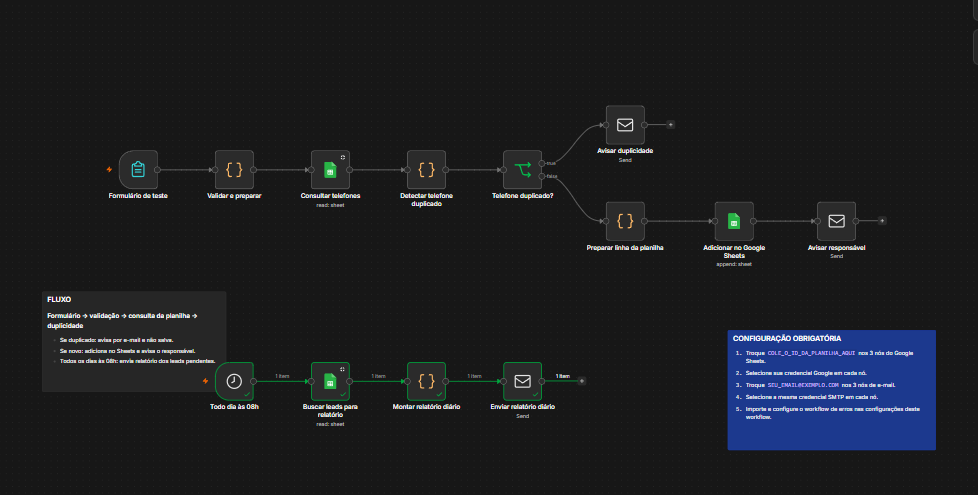
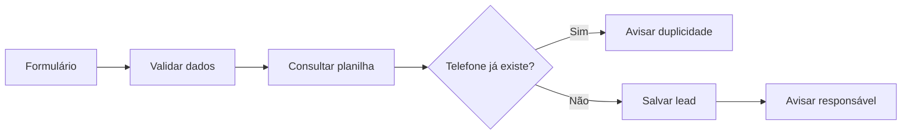

# Automação de Leads com n8n

Criei este projeto para resolver um problema comum em empresas: receber leads, organizar os dados e avisar rapidamente a pessoa responsável pelo atendimento.

A ideia foi montar uma automação completa, e não apenas um fluxo simples de formulário para planilha.

## Como funciona

O cliente preenche um formulário com nome, telefone, serviço desejado e origem do contato.

Antes de cadastrar o lead, o workflow valida os dados e consulta o Google Sheets para verificar se o telefone já existe.

Se for um contato novo, ele é salvo na planilha e o responsável recebe um e-mail. Se o telefone já estiver cadastrado, a automação bloqueia o novo registro e envia um aviso de duplicidade.

## O que foi implementado

* Formulário para entrada dos leads
* Validação dos dados recebidos
* Padronização dos números de telefone
* Verificação de contatos duplicados
* Cadastro automático no Google Sheets
* Status inicial e responsável definidos automaticamente
* Data para o próximo acompanhamento
* Notificação por e-mail para novos leads
* Alerta por e-mail para telefones duplicados
* Relatório diário com os leads pendentes
* Workflow separado para tratamento de erros

## Tecnologias utilizadas

* n8n
* Google Sheets
* Gmail SMTP
* Docker
* JavaScript
* Git e GitHub

## Arquivos

* `01-workflow-leads.json`: automação principal
* `02-tratamento-de-erros.json`: tratamento e aviso de erros
* `modelo-planilha-leads.csv`: estrutura utilizada no Google Sheets

## Como testar

1. Importe os dois workflows no n8n.
2. Crie uma planilha com uma aba chamada `Leads`.
3. Use os cabeçalhos disponíveis no arquivo CSV.
4. Configure as credenciais do Google Sheets e do Gmail.
5. Vincule o workflow de erros ao workflow principal.
6. Publique os workflows e abra o formulário.

## Testes realizados

Durante o desenvolvimento, testei:

* Cadastro de um lead novo
* Tentativa de cadastrar o mesmo telefone novamente
* Gravação dos dados no Google Sheets
* Envio dos avisos por e-mail
* Geração do relatório diário
* Envio de dados inválidos
* Acionamento automático do workflow de erros

## O que aprendi

Esse projeto me ajudou a praticar integração entre serviços, validação de dados, criação de diferentes caminhos dentro de um workflow e tratamento de possíveis falhas da automação.

Também trabalhei com Docker para executar o n8n localmente e com Git/GitHub para organizar e documentar o projeto.

## Segurança

Os arquivos publicados neste repositório não contêm senhas, tokens, credenciais, e-mails pessoais ou links privados.

## Autor

João Dias

